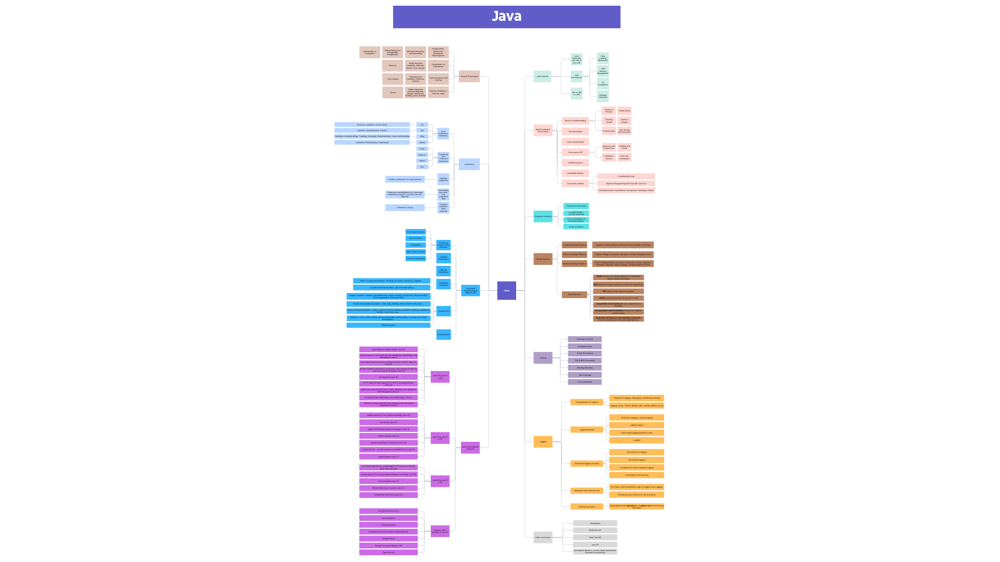

# Java Interview Mindmap

🧠 This repository contains a comprehensive **Java Mindmap** designed to help you:

- 📝 Prepare for Java interviews (junior to senior levels)
- 🔄 Refresh your core Java knowledge
- 📚 Structure your learning path effectively

## 📌 What's Inside

The mindmap covers almost all key areas of Java : 

- Core Principles
- OOP Principles
- JVM Internals
- Multithreading & Concurrency
- Collections
- Exception Handling
- Functional Programming & Streams API
- Java 9 and beyond features
- Design patterns
- Testing
- Logging

👉 Click the image to open the **interactive Canva mind map**. 

## 💡 Why Use a Mindmap?

Mindmaps provide a **visual and structured overview** that makes complex topics easier to digest, review, and retain. This is especially helpful for interview preparation when you want to:

- Quickly revisit key concepts
- Spot knowledge gaps
- Get the "big picture" view of Java

---

Feel free to contribute or suggest additions!

📬 [Connect with me on LinkedIn](https://www.linkedin.com/in/nasriachraf/) if you find this useful or have feedback.
