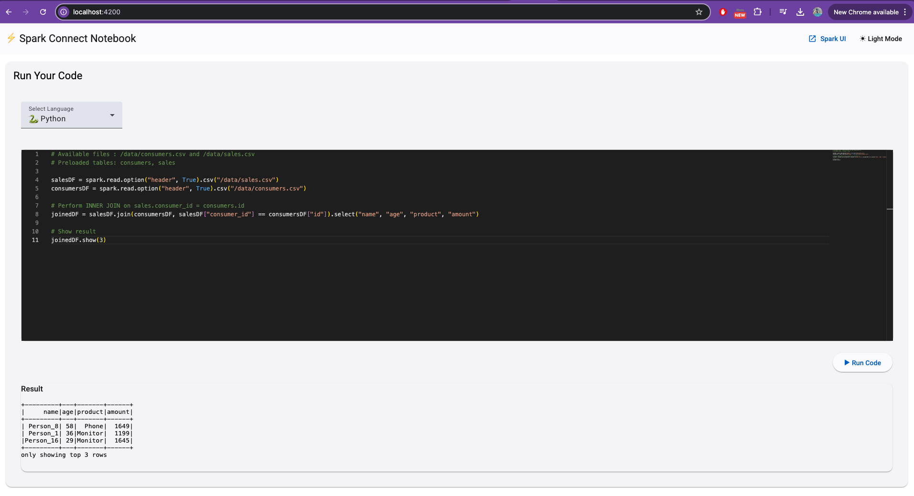
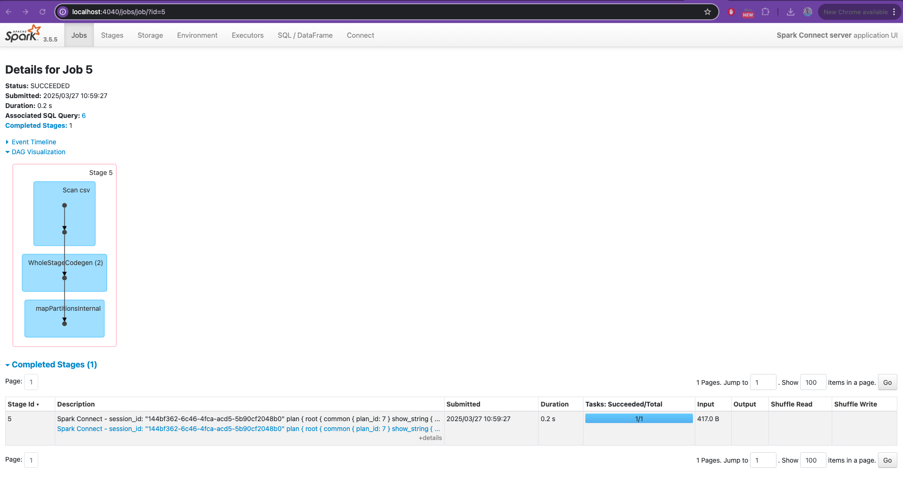

# 📘 Exploring Apache Spark Connect: A Minimal Notebook to Run Spark Code Remotely

---

## 🧭 1. Introduction to Apache Spark

Apache Spark is an open-source distributed computing engine designed for large-scale data processing. It offers powerful APIs for working with structured and unstructured data using languages like Python, Scala, Java, and SQL.

Its in-memory processing capabilities make it fast and efficient for use cases such as:

- ETL pipelines  
- Data analytics  
- Machine learning  
- Streaming processing  

Traditionally, Spark code had to run within the cluster environment. But that's changing…

---

## 🔌 2. What is Spark Connect?

With the release of **Apache Spark 3.4**, a new client-server architecture was introduced: **Spark Connect**.

This architecture decouples the Spark client from the Spark server, allowing you to:

- Connect remotely to a Spark cluster over **gRPC**
- Use a lightweight client (e.g. Jupyter, REST API, web app)
- Write Spark code (**SQL or PySpark**) outside the cluster, and send it for execution
- Reuse the **SparkSession** and context without spinning up a new driver each time

> In short: Spark becomes a service that can be queried and controlled remotely.

---

## 🧪 3. My Proof of Concept: A Minimal Spark Connect Notebook

I built a simple interactive notebook interface that connects to a remote Spark cluster using Spark Connect.  
The goal: **run PySpark or SQL code from outside the cluster**, with minimal setup and zero manual configuration.

### 🔧 Key Features:

- Built in **Python** using `pyspark`
- Supports **Spark SQL** and **PySpark** code execution
- Connects to an existing **Spark Connect server**
- **Lightweight and easy to extend**
- Fully **dockerized** setup — launch everything with a single command

---

## 🧪 Demo & Repository

🧭 **Repository:**  
👉 [GitHub – spark-connect-notebook](https://github.com/achraf-nasri/spark-connect-notebook)

🖥️ **Demo Screenshot:**
  

Once the stack is running via Docker Compose, you can:
- Write code in the frontend notebook
- Send it to the backend API
- Execute it remotely on a Spark cluster via Spark Connect

It’s ideal for testing, learning, or building your own interactive Spark tools.

---

## ✅ Conclusion

This minimal notebook setup shows how easy it is to connect to Spark remotely using Spark Connect. It simplifies the development of external tools that interact with Spark — from notebooks to full web UIs.

Let me know what you think or feel free to contribute ideas or improvements!
