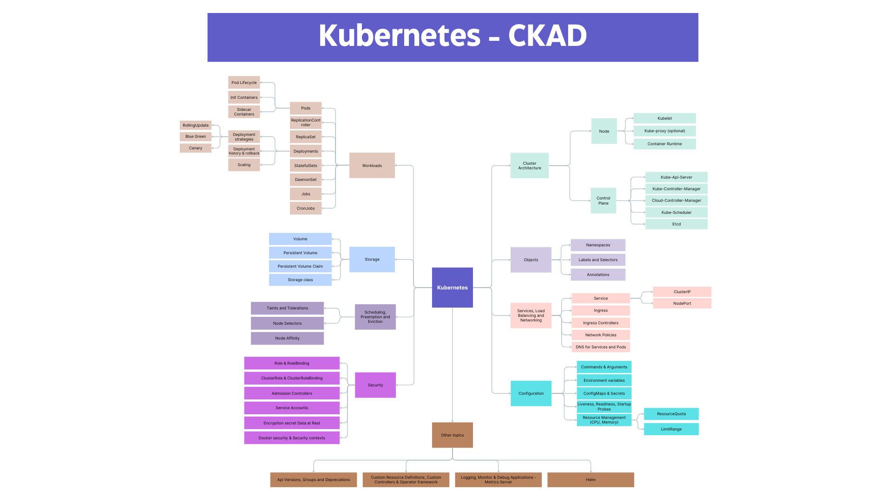

# 🧑‍💻 My CKAD Certification Journey (5 STEPS)

This guide outlines the process I followed to prepare for and obtain the **Certified Kubernetes Application Developer (CKAD)** certification. It includes recommended resources, time estimates, and personal insights to help you efficiently achieve the certification.

---

## 🗺️ 1. [Optional] Get Familiar with Kubernetes Basics

If you're an **absolute beginner**, I highly recommend spending a few hours understanding the **basics of Kubernetes**, its **purpose**, and **installing it locally** (using Minikube or Kind) to start experimenting.

This will **boost your confidence** and make the upcoming steps much easier.

🎥 **Recommended Resource**  
[Kubernetes Crash Course by TechWorld with Nana (YouTube – 1 Hour)](https://www.youtube.com/watch?v=s_o8dwzRlu4)

---

## 📚 2. Main Study Resource – CKAD Udemy Course

Since I already had experience using Kubernetes, I jumped directly into the course:  
**[Kubernetes Certified Application Developer (CKAD) with Tests – Udemy](https://www.udemy.com/course/certified-kubernetes-application-developer/)**

This course provides:
- **Theory knowledge**
- **Hands-on labs** (very important, as the CKAD certification is 100% practical)

🕒 **Course duration**: ~15 hours (without labs)  
📅 **Study estimate**: I allocated **3–4x the course time** for deeper learning, external resources, and lab work.  
➡️ Total estimated time: **45–60 hours**

---

## 🧪 3. Practice – Lightning Labs & Mock Exams

By the end of the course, you’ll find two key sections:

### ⚡ Lightning Labs  
These are **hard**! If you can complete them **within the allocated time**, you're likely **ready for the exam**.  
> The difficulty here is **higher than the real exam**.

### 📝 Mock Exams  
These are **easier** than Lightning Labs.  
> In my case, the **actual exam was similar to or slightly harder** than these mocks.

---

## 🧠 4. [Optional] Consolidate Knowledge with a Mind Map

I studied **8 hours/day for 5 days** and completed the course fast — it was **a lot to absorb**, and I felt overwhelmed.

So I spent **an extra day** building a **mind map** to:
- Review and reinforce what I learned
- Visually organize the key topics

📎 **I’ll attach my mind map below** — feel free to check it, but I **highly recommend creating your own** to truly consolidate knowledge.

---

## 🔁 5. More Practice – Killer.sh & Killercoda

When you buy a CKAD exam voucher, you get **free access** to:

### ✅ Killercoda  
- Easy, guided labs  
- At this stage, you should be able to complete these **without difficulty**

### 💀 Killer.sh  
- Two **exam-like practice environments** (valid for 36 hours each, within 3 days)  
- The mock exams here are **harder and longer** than the real CKAD exam  
> Another great test: if you score well here, **you are ready**.

---

## 📝 Exam Information & Final Tips

- 🕒 **Duration**: 2 hours
- 🔁 **Attempts**: You get **2 attempts** with one exam purchase
- 📖 **Open Book**: Access to the **official Kubernetes documentation** is allowed during the exam
- ✅ **Passing Score**: Minimum **66%** to pass the CKAD certification (as of today)

> 💡 **Tip 1 – Documentation**: Familiarize yourself with navigating the Kubernetes docs efficiently — it saves a lot of time during the exam!

> 💡 **Tip 2 – Time Management**: Don’t get stuck on one exercise. If you're stuck, **tag it and move to the next one**. At the end, **go back to unresolved exercises** with the remaining time.

---

## 🧩 CKAD Mind Map: Key Topics to Remember
👉 Click the image to open the **interactive Canva mind map**.

---

## 📂 Resources

- [Kubernetes Official Documentation](https://kubernetes.io/docs/)
- [CKAD Exam Curriculum](https://github.com/cncf/curriculum)
- [CKAD Exercices](https://github.com/dgkanatsios/CKAD-exercises)
